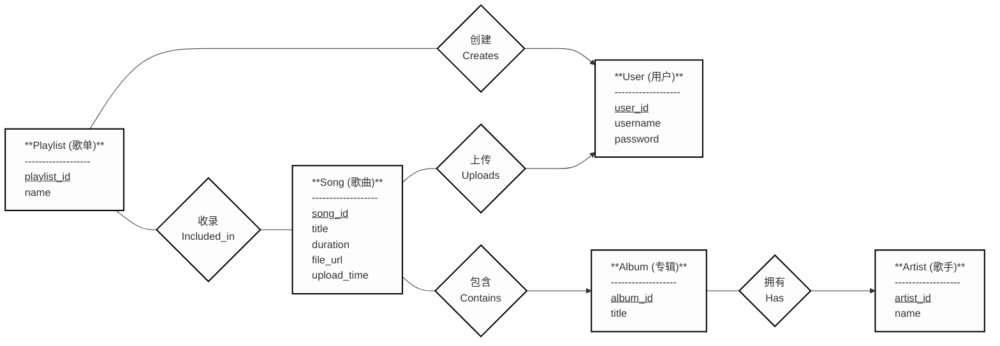
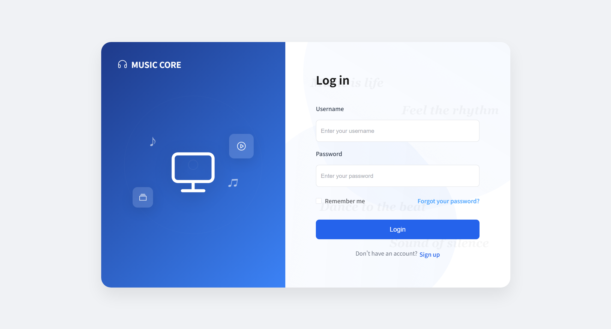
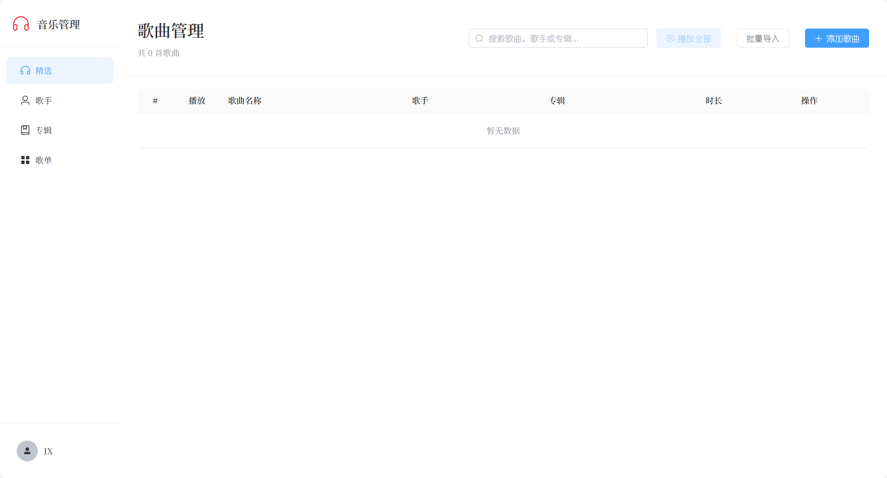
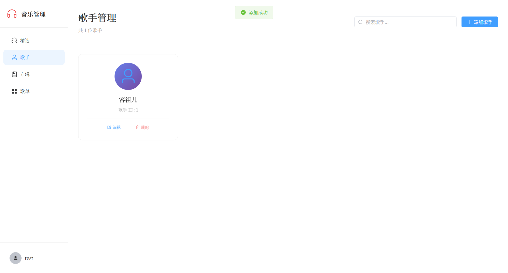
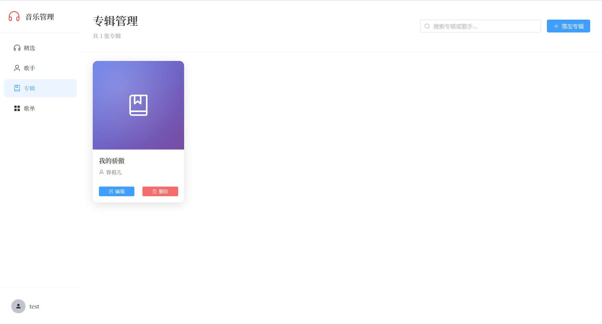
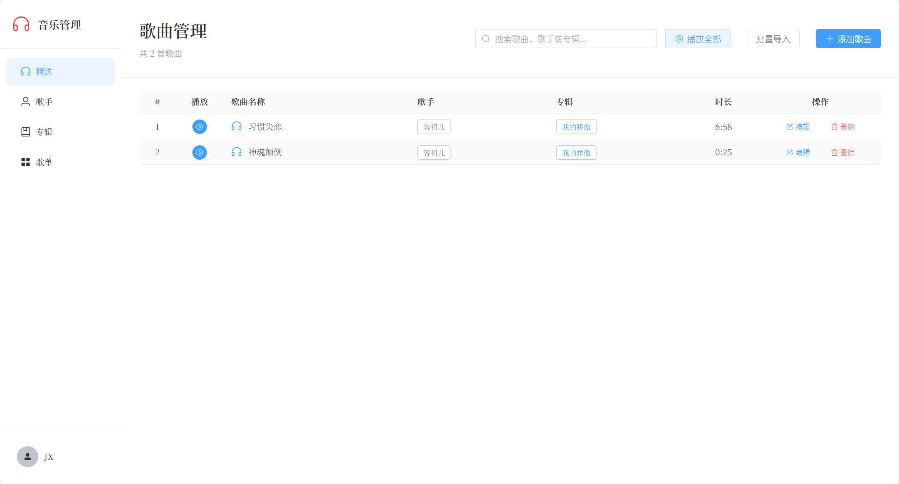
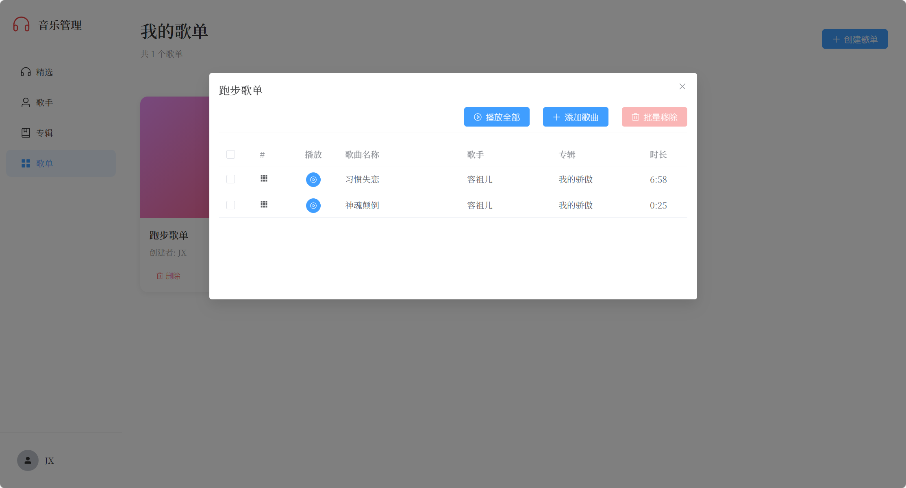

### 中山大学2023级数据库系统概念期末大作业
## 1. 应用需求介绍

在线音乐管理播放平台，核心目标就是给用户提供顺手、便捷的个人音乐库管理服务，围绕“管好音乐、轻松听歌”展开。

一、用户认证系统

用户得先登录才能用平台的所有功能，未登录状态下只有登录注册页面，没法操作个人音乐库、创建歌单这些核心功能。系统要妥善保管用户的个人信息，同时明确用户的数据权限——每个人只能查看、管理自己添加的歌手、专辑、歌曲和歌单，看不到其他用户的私有内容，保障数据独立性。

二、资源管理

这部分主要是让用户能自主打理音乐相关资源，每一项都要实用好操作。

歌手管理：用户可以手动添加歌手信息，比如姓名、风格标签、简介这些内容，也能随时查看已添加的歌手列表，方便后续关联专辑和歌曲。

专辑管理：支持用户创建专属专辑，创建时要能绑定到之前添加的歌手，相当于给专辑明确“归属”。专辑信息里可以补充封面图、发行时间、专辑简介，让音乐库分类更清晰。

歌曲管理：核心是支持上传本地歌曲文件，上传后系统自动抓取或让用户补充元数据，包括歌曲标题、播放时长、所属专辑和歌手，确保每首歌信息完整。上传完成后就能直接在线播放，不用跳转其他工具。

三、歌单功能

歌单是用户整理个性化曲库的核心，支持自由创建自定义歌单，自己起名字、备注用途（比如“通勤歌单”“健身必备”）。后续可以随意把喜欢的歌曲加入歌单

四、播放功能

前端页面要设置一个全局播放条，固定在页面底部，不管用户浏览到平台哪个页面，都能随时控制音乐播放状态。播放条上要包含最基础的播放、暂停按钮，还有上一曲、下一曲切换控件，操作直观。

## 2. 数据库设计的 ER 图

### 2.1 应用系统的设计

为了管理用户，我们设计users表，为了管理歌曲，我们设置songs表，用户和歌曲之间存在上传联系，所以我们有联系表uploads来记录用户上传的歌曲。为了管理歌手，我们设计artists表，用户可以添加和管理自己的歌手信息。为了管理专辑，我们设计albums表，每个专辑关联到一个歌手和创建它的用户。为了管理歌单，我们设计playlists表，用户可以创建自己的歌单，并通过playlist_songs表将歌曲添加到歌单中，实现多对多的关联。这样，整个数据库设计围绕用户为中心，确保数据隔离和权限控制，同时支持音乐资源的全面管理。

### 2.2 实体关系图 (ER Diagram)

### 2.3 表结构说明

#### users (用户表)
存储用户基本信息，是整个系统的核心实体表。

| 字段名 | 数据类型 | 约束 | 说明 |
|--------|----------|------|------|
| user_id | SERIAL | PRIMARY KEY | 用户唯一标识，自增主键 |
| username | VARCHAR(50) | UNIQUE NOT NULL | 用户名，不可重复 |
| password | VARCHAR(100) | NOT NULL | 用户密码 |

#### artists (歌手表)
存储歌手信息，每条记录关联到创建它的用户，实现用户级别的数据隔离。

| 字段名 | 数据类型 | 约束 | 说明 |
|--------|----------|------|------|
| artist_id | SERIAL | PRIMARY KEY | 歌手唯一标识，自增主键 |
| name | VARCHAR(100) | NOT NULL | 歌手姓名 |
| user_id | INT | FOREIGN KEY → users(user_id) | 创建该歌手的用户ID |

#### albums (专辑表)
存储专辑信息，每个专辑关联一个歌手和创建用户。

| 字段名 | 数据类型 | 约束 | 说明 |
|--------|----------|------|------|
| album_id | SERIAL | PRIMARY KEY | 专辑唯一标识，自增主键 |
| title | VARCHAR(100) | NOT NULL | 专辑名称 |
| artist_id | INT | FOREIGN KEY → artists(artist_id) | 所属歌手ID |
| user_id | INT | FOREIGN KEY → users(user_id) | 创建该专辑的用户ID |

#### songs (歌曲表)
存储歌曲核心信息及文件路径，关联歌手、专辑和上传用户。

| 字段名 | 数据类型 | 约束 | 说明 |
|--------|----------|------|------|
| song_id | SERIAL | PRIMARY KEY | 歌曲唯一标识，自增主键 |
| title | VARCHAR(100) | NOT NULL | 歌曲标题 |
| artist_id | INT | FOREIGN KEY → artists(artist_id) | 所属歌手ID |
| album_id | INT | FOREIGN KEY → albums(album_id) | 所属专辑ID |
| duration | INT | - | 歌曲时长（秒） |
| file_url | VARCHAR(255) | - | 音频文件存储路径 |
| user_id | INT | FOREIGN KEY → users(user_id) | 上传该歌曲的用户ID |
| upload_time | TIMESTAMP | - | 上传时间戳 |

#### playlists (歌单表)
存储用户创建的歌单基本信息。

| 字段名 | 数据类型 | 约束 | 说明 |
|--------|----------|------|------|
| playlist_id | SERIAL | PRIMARY KEY | 歌单唯一标识，自增主键 |
| name | VARCHAR(100) | - | 歌单名称 |
| user_id | INT | FOREIGN KEY → users(user_id) | 创建该歌单的用户ID |

#### playlist_songs (歌单-歌曲关联表)
多对多关系的中间表，实现歌单与歌曲的关联。一个歌单可以包含多首歌曲，一首歌曲也可以被添加到多个歌单中。

| 字段名 | 数据类型 | 约束 | 说明 |
|--------|----------|------|------|
| playlist_id | INT | FOREIGN KEY → playlists(playlist_id) | 歌单ID |
| song_id | INT | FOREIGN KEY → songs(song_id) | 歌曲ID |
| - | - | PRIMARY KEY (playlist_id, song_id) | 联合主键，确保同一歌单中不重复添加同一歌曲 |

## 3. 系统实现

### 3.1 技术架构

本系统采用前后端分离架构，前端使用Vue 3框架搭配Vite构建工具，后端基于Flask轻量级Web框架开发，通过psycopg2库实现与OpenGauss数据库的连接。前后端通过RESTful API进行数据交互，使用JSON格式传输数据。

### 3.2 后端实现

后端采用模块化设计，主要包含以下几个部分：

**核心模块**
- `app.py`: Flask应用主入口，负责初始化应用、注册路由蓝图和启动服务器
- `config.py`: 配置文件，存储数据库连接信息、上传路径等系统配置
- `db.py`: 数据库连接管理模块，封装数据库连接的获取和释放操作
- `init_db.py`: 数据库初始化脚本，根据schema.sql创建表结构

**路由模块** (`routes/`)
- `auth.py`: 处理用户注册、登录、身份验证等功能
- `artists.py`: 歌手信息的增删改查接口
- `albums.py`: 专辑管理相关接口
- `songs.py`: 歌曲上传、查询、播放等功能接口
- `playlists.py`: 歌单创建及歌曲添加/移除接口

所有路由模块都注册为Flask蓝图，便于代码组织和维护。后端使用session机制进行用户状态管理，确保每个用户只能访问自己的数据。文件上传功能将音乐文件保存到`uploads/`目录，并在数据库中记录文件路径。

### 3.3 前端实现

前端采用Vue 3组合式API开发，项目结构如下：

**页面组件** (`views/`)
- `login.vue`: 登录注册页面
- `home.vue`: 首页，展示用户音乐库概览
- `Artists.vue`: 歌手管理页面
- `Albums.vue`: 专辑管理页面
- `songs.vue`: 歌曲列表和上传页面
- `Playlists.vue`: 歌单管理页面

**功能组件** (`components/`)
- `PlayerBar.vue`: 全局播放控制条，固定在页面底部，提供播放/暂停、上一曲/下一曲等功能

**状态管理** (`stores/`)
- `user.js`: 使用Pinia管理用户登录状态
- `player.js`: 管理当前播放歌曲、播放列表、播放状态等信息

**接口封装** (`api/`)
- `index.js`: 统一封装后端API调用，使用axios库发送HTTP请求

前端路由使用vue-router实现页面切换，通过路由守卫验证用户登录状态，未登录用户会被重定向到登录页。

### 3.4 数据库连接

使用psycopg2库实现Python与OpenGauss的交互。在`db.py`中封装了数据库连接池管理，每次请求从连接池获取连接，使用完毕后归还连接，提高资源利用率。数据库配置信息存储在`config.py`中，包括数据库地址、端口、用户名、密码等参数。

### 3.5 接口设计

后端提供的主要API接口：

**用户认证**
- `POST /api/auth/register`: 用户注册
- `POST /api/auth/login`: 用户登录
- `GET /api/auth/logout`: 用户登出

**资源管理**
- `GET /api/artists`: 获取当前用户的歌手列表
- `POST /api/artists`: 添加歌手
- `GET /api/albums`: 获取专辑列表
- `POST /api/albums`: 创建专辑
- `GET /api/songs`: 获取歌曲列表
- `POST /api/songs/upload`: 上传歌曲文件
- `GET /api/songs/<id>/stream`: 获取歌曲音频流

**歌单功能**
- `GET /api/playlists`: 获取用户歌单
- `POST /api/playlists`: 创建歌单
- `POST /api/playlists/<id>/songs`: 添加歌曲到歌单
- `DELETE /api/playlists/<id>/songs/<song_id>`: 从歌单移除歌曲

所有涉及数据修改的接口都会验证用户身份，确保数据安全。

### 3.6 系统主要运行界面

- **登录注册界面**:

系统登录页面采用简洁的表单设计，包含用户名和密码输入框。用户可以在此页面完成账号注册或登录操作。未登录状态下，用户无法访问系统的其他功能页面，会被自动重定向至此页面。登录成功后，系统会记录用户会话状态，允许访问个人音乐库管理功能。

- **首页界面**:

首页作为用户登录后的主要入口，展示了音乐库的基本统计信息和快捷导航。页面顶部包含导航栏，提供跳转到歌手、专辑、歌曲、歌单等管理页面的入口。底部固定显示全局播放控制条，方便用户随时控制音乐播放。

- **歌手管理界面**:

歌手管理页面展示当前用户添加的所有歌手信息列表。页面提供"添加歌手"按钮，点击后弹出表单对话框，允许用户输入歌手名称等信息。歌手列表以卡片或表格形式展示，每个歌手条目支持查看详情、编辑和删除操作。这里展示的歌手数据仅限于当前登录用户创建的内容。

- **专辑管理界面**:

专辑管理页面用于查看和管理用户创建的专辑。创建专辑时需要选择已有的歌手进行关联，建立专辑与歌手的从属关系。页面列表展示专辑标题、所属歌手等信息，支持对专辑进行编辑和删除操作。

- **歌曲管理界面**:

歌曲管理页面是系统的核心功能之一，展示用户上传的所有歌曲列表。页面顶部提供"上传歌曲"按钮，点击后打开文件选择对话框，支持上传本地音乐文件。上传时需要填写歌曲标题、选择所属歌手和专辑、输入时长等元数据信息。

歌曲列表以表格形式呈现，包含歌曲名称、歌手、专辑、时长、上传时间等字段。每首歌曲提供播放按钮，点击后在底部播放条中加载并播放该歌曲。列表还提供编辑和删除功能，方便用户管理音乐库。

- **歌单管理界面**:

歌单管理页面展示用户创建的所有歌单。用户可以创建新歌单并自定义名称，点击歌单后进入歌单详情页面，查看该歌单包含的所有歌曲。

歌单详情页面显示歌单内的歌曲列表，提供"添加歌曲"功能，允许用户从自己的音乐库中选择歌曲加入当前歌单。歌单内的歌曲支持播放和移除操作，用户可以灵活管理歌单内容。

- **播放控制条**:

播放控制条固定在页面底部，在所有页面均可见。控制条显示当前播放歌曲的标题和歌手信息，提供播放/暂停、上一曲、下一曲等基本控制按钮。播放进度通过进度条直观展示，用户可以拖动进度条快速定位播放位置。播放状态在全局共享，切换页面不会中断音乐播放。

## 4. 成员分工

本项目采用前后端分离的开发模式，小组成员根据各自的技术特长进行任务分配，具体分工如下：

## 5. 项目部署

采用容器化部署方式，用docker部署在容器托管平台上。

可运行网址: http://music.lanternian.xyz

